# GOA systems documentation example

## Requirements

The following list contains the required dependencies to execute this examples `build.ps1`.

* [MiKTeX](https://miktex.org) - with pdflatex package
* [Pandoc](https://pandoc.org)
* [Eisvogel document template](https://github.com/Wandmalfarbe/pandoc-latex-template)
* [MkDocs](https://www.mkdocs.org)
* [Python](https://www.python.org)

## Installing prerequisites

### MiKTeX

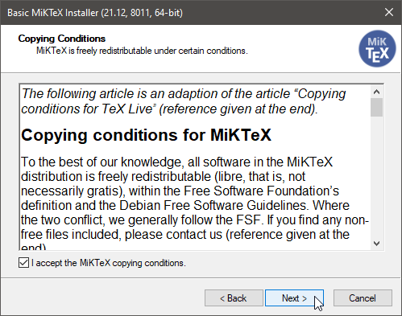

Choose installation for current user only. This avoids providing administrator credentials.


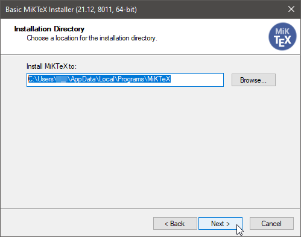


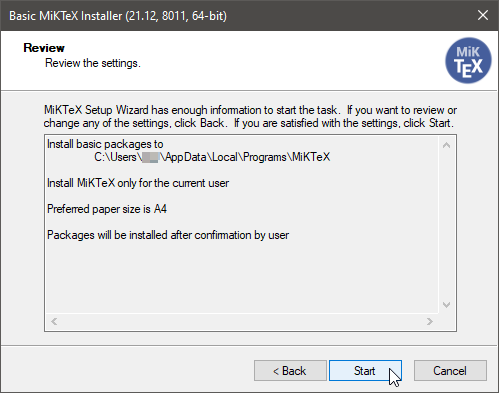

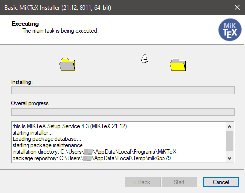

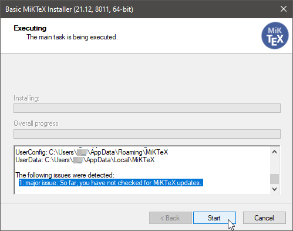

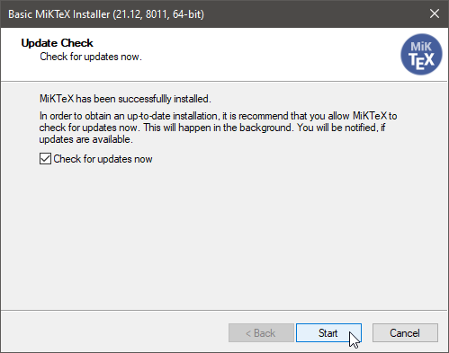

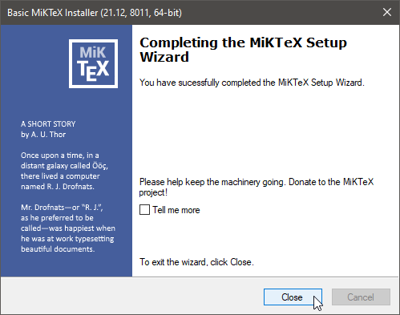

After the installation open the installed application.

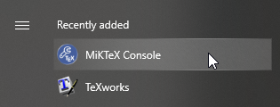

Follow the screenshots to update the installed and install the required packages.

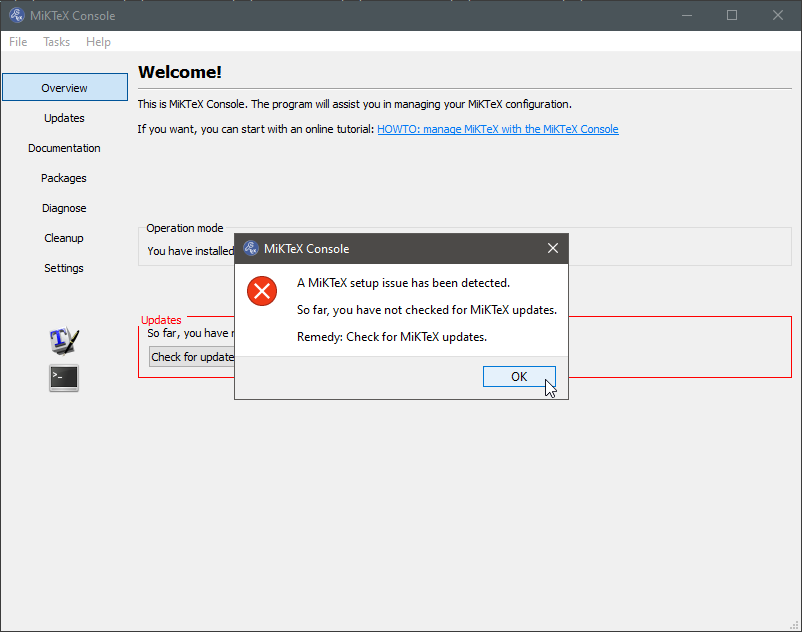

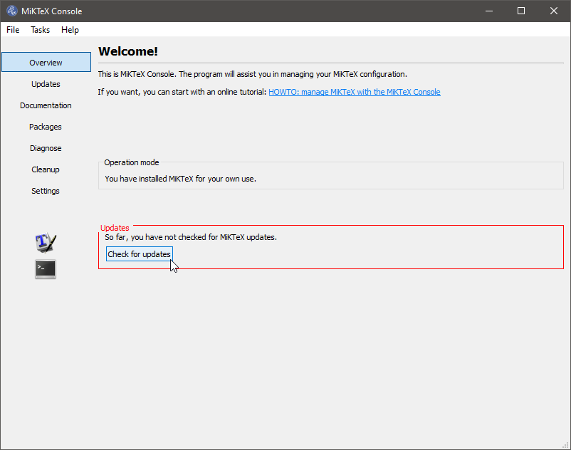

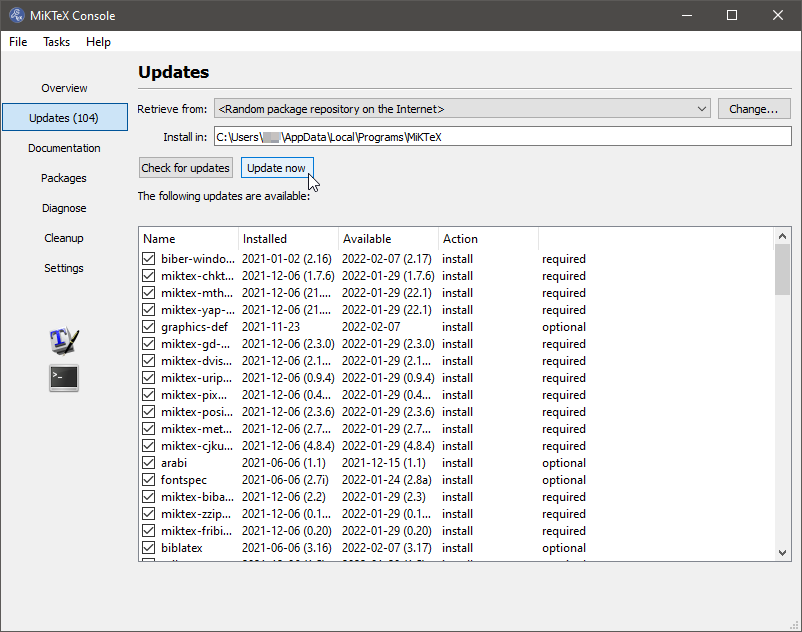

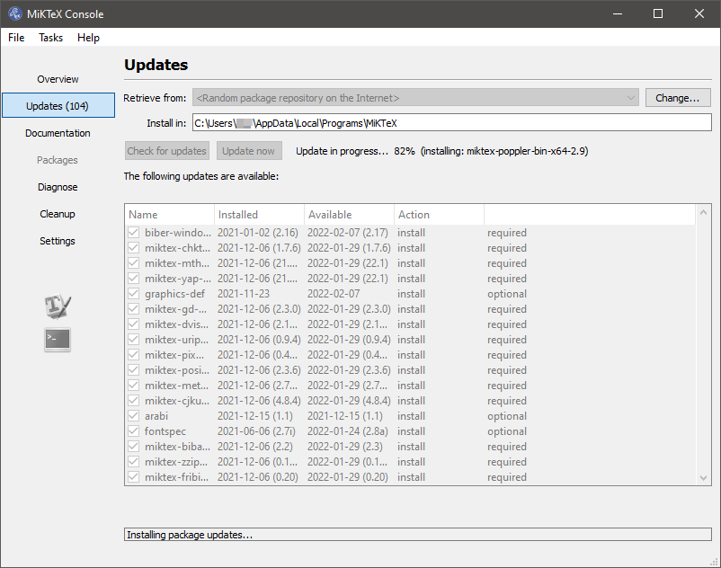

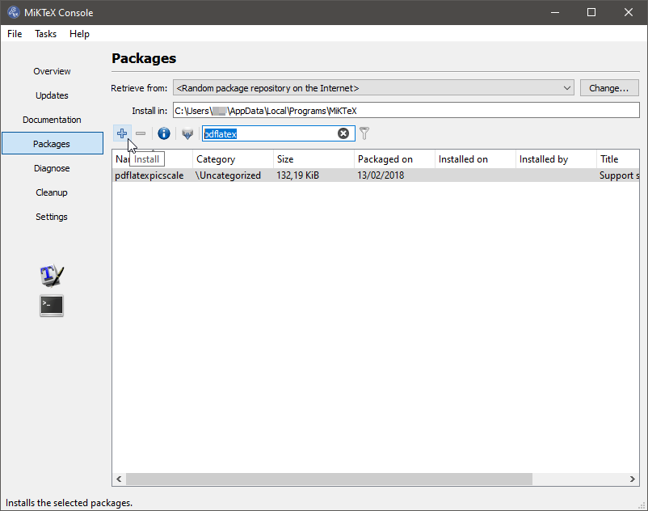

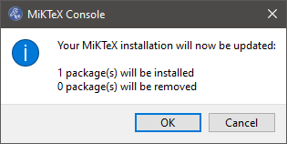

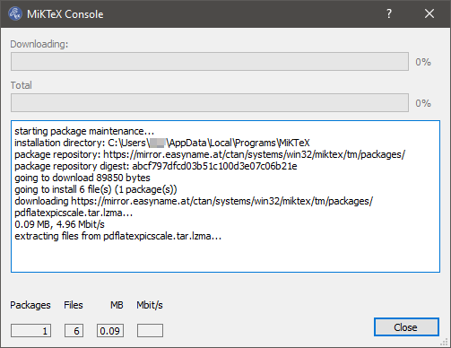

During usage dialogs like the following two might come up. This means that additional packages have to be installed. The first one is suitable for single packages to keep the overview what needs to be installed. The second one is for batch installations. Just uncheck "Always show this dialog" for automated package installation.

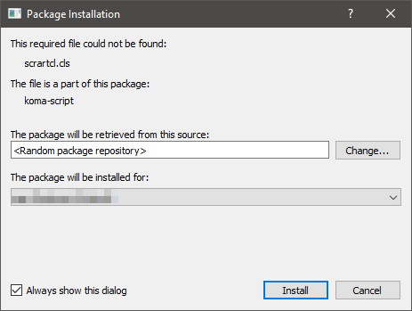


### Pandoc

Installation of Pandoc is easier. It gets automatically installed into the directory:

```
%LocalAppData%\Pandoc
```

Also the users %PATH% variable gets set to make it available on the command line.

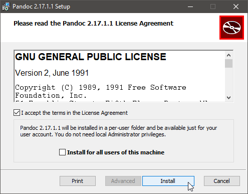


#### Eisvogel template

Download and extract the template from the [releases page](https://github.com/Wandmalfarbe/pandoc-latex-template/releases), extract the zip file and copy the template to the following location:

```
"%AppData%\pandoc\templates\eisvogel.latex"
```

### Python (required to install MkDocs)

Download and install Python from the [distributions download page](https://www.python.org/downloads).

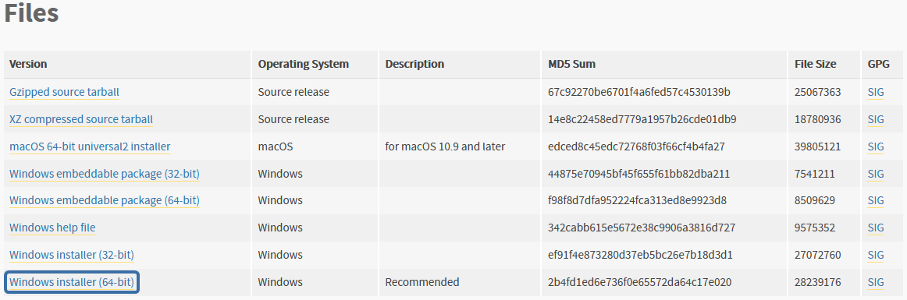

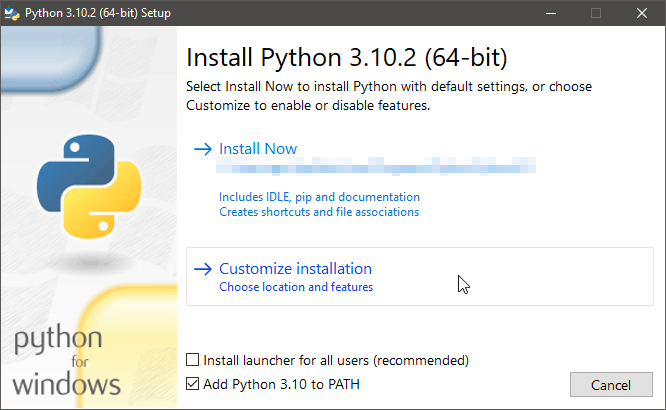

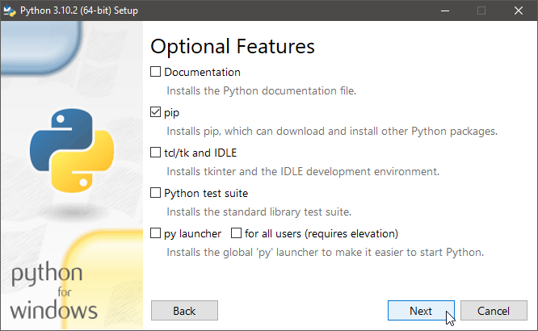

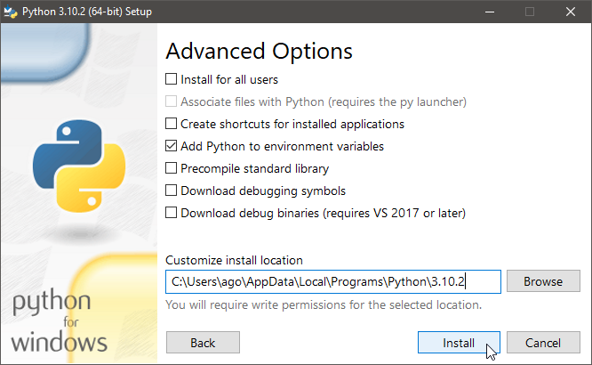

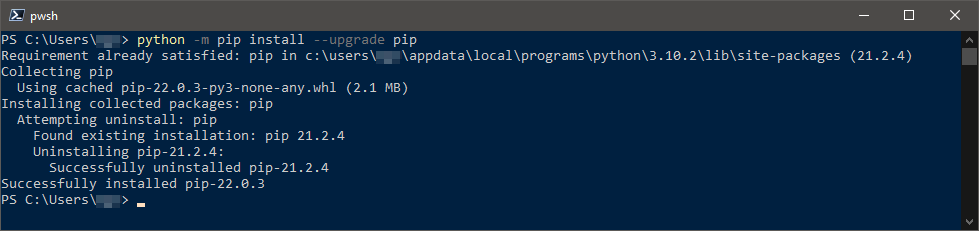

#### MkDocs